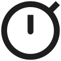

# CoBlocks Icons

| Name (slug)   | Icon   | Style   | Component name   | Keywords   |
| ------------- | ------ | ------- | ---------------- | ---------- |
| Accessible (accessible) |  | default | AccessibleIcon |  handicapped, health care, medical, wheelchair |
| Accordion Item (accordion-item) |  | default | AccordionItemIcon |  interface, modal, window |
| Accordion (accordion) |  | default | AccordionIcon |  item, window |
| Diagram (accounttree) |  | default | AccounttreeIcon |  blueprint, flowchart, hierarchy, layout, map, sitemap |
| |  | outlined | AccounttreeStyles.outlined | |
| Album (album) |  | default | AlbumIcon |  audio, bullseye, media, music, song, target |
| |  | outlined | AlbumStyles.outlined | |
| Alert (alert) |  | default | AlertIcon |  bell, danger, ring, sound, warning |
| Infinity (allinclusive) |  | default | AllinclusiveIcon |  cycle, eternal, figure eight, loop |
| Animation (animation) |  | default | AnimationIcon |  balls, loading, movement, progression |
| Aperture (aperture) |  | default | ApertureIcon |  camera, creative, film, media, photo, photography |
| |  | outlined | ApertureStyles.outlined | |
| At (at) |  | default | AtIcon |  at sign, email, letter, mail, mention, message, symbol |
| Audiotrack (audiotrack) |  | default | AudiotrackIcon |  media, music, podcast, song, sound, tune |
| |  | outlined | AudiotrackStyles.outlined | |
| Author (author) |  | default | AuthorIcon |  head, human, people, person |
| Blocks (blocks) |  | default | BlocksIcon |  boxes, build, square, stack, widgets |
| |  | outlined | BlocksStyles.outlined | |
| Blur (bluron) |  | default | BluronIcon |  dots, plot, random |
| Brush (brush) |  | default | BrushIcon |  artist, colors, creative, design, media, paint, paintbrush, palette |
| |  | outlined | BrushStyles.outlined | |
| Bubble (bubble) |  | default | BubbleIcon |  conversation, head, human, people, person, speach, speak, talk, testimonial |
| Tools (build) |  | default | BuildIcon |  build, construction, settings, work, wrench |
| |  | outlined | BuildStyles.outlined | |
| Cake (cake) |  | default | CakeIcon |  baking, birthday, celebration, food, fun, party, taste |
| Calendar (calendar) |  | default | CalendarIcon |  date, day, month, time |
| Camera (camera) |  | default | CameraIcon |  aperture, creative, film, media, photography, photo |
| |  | outlined | CameraStyles.outlined | |
| Caret (caret) |  | default | CaretIcon |  arrow, direction, up |
| Cast (cast) |  | default | CastIcon |  broadcast, chromecast, screen, television, tv, video, vodcast |
| Checklist (checklist) |  | default | ChecklistIcon |  check, done, list, okay, task |
| Checkmark circle (checkmark-circle) |  | default | CheckmarkCircleIcon |  check, confirm, done, okay |
| Add Circle (circle-add) |  | default | CircleAddIcon |  add, circle, insert, math, plus |
| |  | outlined | CircleAddStyles.outlined | |
| Substract Circle (circle-remove) |  | default | CircleRemoveIcon |  remove, circle, insert, delete, math, minus |
| |  | outlined | CircleRemoveStyles.outlined | |
| City (city) |  | default | CityIcon |  building, business, corporation, location, map, public, skyscraper, town |
| Cloud (cloud) |  | default | CloudIcon |  forecast, internet, network, rain, sky, weather |
| |  | outlined | CloudStyles.outlined | |
| CoBlocks (coblocks) |  | default | CoblocksIcon |  blocks, build, design, gutenberg |
| Color Palette (color-palette) |  | default | ColorPaletteIcon |  artist, creative, design, media, paint, palette |
| |  | outlined | ColorPaletteStyles.outlined | |
| Color Picker (color-picker) |  | default | ColorPickerIcon |  artist, creative, design, eye dropper, media, paint, palette |
| |  | outlined | ColorPickerStyles.outlined | |
| Column (column) |  | default | ColumnIcon |  divider, middle, separator |
| Ticket (confirmationnumber) |  | default | ConfirmationnumberIcon |  admission, coupon, receipt, voucher |
| |  | outlined | ConfirmationnumberStyles.outlined | |
| Content (content) |  | default | ContentIcon |  line, paragraph, text |
| Couch (couch) |  | default | CouchIcon |  chair, chill, relax, rest, sleep, sofa, weekend |
| |  | outlined | CouchStyles.outlined | |
| Counter (counter) |  | default | CounterIcon |  count, number, stats, ticker, time, watch |
| Credit Card (credit-card) |  | default | CreditCardIcon |  cash, checkout, commerce, ecommerce, money, payment, shop, store |
| Custom typography (custom-typography) |  | default | CustomTypographyIcon |  alphabet, letter, text |
| Pie Chart (data-usage) |  | default | DataUsageIcon |  analytics, chart, circle, data, graph, pie, stats |
| Desktop (desktop-mac) |  | default | DesktopMacIcon |  computer, device, monitor, office, pc, screen |
| |  | outlined | DesktopMacStyles.outlined | |
| Desktop (desktop) |  | default | DesktopIcon |  square, window |
| Hub (device-hub) |  | default | DeviceHubIcon |  connect, device, share, social, usb |
| Devices (devices) |  | default | DevicesIcon |  computer, ipad, office, pc, screen, surface |
| Devices Alternate (devicesalternate) |  | default | DevicesalternateIcon |  computer, desk, devices, ipad, office, pc, screen, surface, tablet, watch |
| Dining (dining) |  | default | DiningIcon |  cafe, cutlery, drink, eat, food, fork, menu, restaurant, spoon, taste |
| Email (drafts) |  | default | DraftsIcon |  letter, mail, message, open, read |
| |  | outlined | DraftsStyles.outlined | |
| Duplicate (duplicate) |  | default | DuplicateIcon |  copy, paper, text |
| Dynamic HR (dynamic-hr) |  | default | DynamicHrIcon |  cursor, divider, horizontal rule |
| Emoticon (emoticon) |  | default | EmoticonIcon |  emotion, fun, happy, joy, smile |
| |  | outlined | EmoticonStyles.outlined | |
| Event item (event-item) |  | default | EventItemIcon |  calendar, date, day, month, time |
| Events (events) |  | default | EventsIcon |  calendar, date, day, month, schedule, time |
| Explore (explore) |  | default | ExploreIcon |  adventure, circle, compass, map, quest, safari browser |
| |  | outlined | ExploreStyles.outlined | |
| Extension (extension) |  | default | ExtensionIcon |  game, plugin, puzzle, widget |
| |  | outlined | ExtensionStyles.outlined | |
| Face (face) |  | default | FaceIcon |  eyes, friendly, happy, hair, head, human, person, user |
| |  | outlined | FaceStyles.outlined | |
| Facebook (facebook) |  | default | FacebookIcon |  media, share, social |
| FAQ (faq) |  | default | FaqIcon |  answer, frequently asked questions, question |
| Feature (feature) |  | default | FeatureIcon |  list, pointer, stack |
| Film (film) |  | default | FilmIcon |  aperture, camera, creative, director, media, photography, producer, video |
| |  | outlined | FilmStyles.outlined | |
| Filter - Dark (filter-dark) |  | default | FilterDarkIcon |  moon, night |
| Filter - Grayscale (filter-grayscale) |  | default | FilterGrayscaleIcon |  black, white |
| Filter - Main (filter-main) |  | default | FilterMainIcon |  shine, star |
| Filter - None (filter-none) |  | default | FilterNoneIcon |  default, mountain |
| Filter - Saturation (filter-saturation) |  | default | FilterSaturationIcon |  drop, water, wet |
| Filter - Sepia (filter-sepia) |  | default | FilterSepiaIcon |  flower, old, shine, star, vintage |
| Filter - Vintage (filter-vintage) |  | default | FilterVintageIcon |  flower, old, sepia |
| Fingerprint (fingerprint) |  | default | FingerprintIcon |  biometric, defense, identify, privacy, safe, scan, secure, security |
| Fire (fire) |  | default | FireIcon |  camping, cook, flame, heat, hot, spicy, trending |
| Fish (fish) |  | default | FishIcon |  fish, sea, sea-creature |
| Flare (flare) |  | default | FlareIcon |  camera, creative, flower, light, photography, sun |
| Filter - Horizontal (flip-horizontal) |  | default | FlipHorizontalIcon |  divider, flip, separator |
| Flip vertical (flip-vertical) |  | default | FlipVerticalIcon |  divider, flip, separator |
| Flower (flower) |  | default | FlowerIcon |  garden, landscape, outdoors, petal, scent, smell |
| |  | outlined | FlowerStyles.outlined | |
| Font (font) |  | default | FontIcon |  alphabet, square, text, typography |
| |  | outlined | FontStyles.outlined | |
| Food and Drink (food-drink) |  | default | FoodDrinkIcon |  bell, ring |
| Food item (food-item) |  | default | FoodItemIcon |  eat, restaurant, tomato, vegetable |
| Form - Checkbox (form-checkbox) |  | default | FormCheckboxIcon |  check, confirm, okay, success |
| Form - Date (form-date) |  | default | FormDateIcon |  date, day, month, time |
| Form - Email (form-email) |  | default | FormEmailIcon |  at sign, email, letter, mail, mention, message, symbol |
| Form - Hidden (form-hidden) |  | default | FormHiddenIcon |  eye, secret |
| Form - Name (form-name) |  | default | FormNameIcon |  paragraph, person, text |
| Form - Phone (form-phone) |  | default | FormPhoneIcon |  call, mobile, number, tablet |
| Form - Radio (form-radio) |  | default | FormRadioIcon |  circle, round, select |
| Form - Select (form-select) |  | default | FormSelectIcon |  collapse, dropdown, option |
| Form - Submit (form-submit) |  | default | FormSubmitIcon |  input |
| Form - Text (form-text) |  | default | FormTextIcon |  input, rectangle |
| Form - Textarea (form-textarea) |  | default | FormTextareaIcon |  paragraph, text |
| Form - Website (form-website) |  | default | FormWebsiteIcon |  browser, safari, web |
| Form (form) |  | default | FormIcon |  envelope, write |
| Format Shapes (formatshapes) |  | default | FormatshapesIcon |  alphabet, font, frame, letter, square, text box, typography |
| Sigma (functions) |  | default | FunctionsIcon |  code, function, greek, math, sigma, sum, total |
| Gallery - Carousel (gallery-carousel) |  | default | GalleryCarouselIcon |  display, mountains |
| Gallery - Collage (gallery-collage) |  | default | GalleryCollageIcon |  display, mountains |
| Gallery - Masonry (gallery-masonry) |  | default | GalleryMasonryIcon |  display, mountains |
| Gallery - Offset (gallery-offset) |  | default | GalleryOffsetIcon |  display, mountains |
| Gallery - Stacked (gallery-stacked) |  | default | GalleryStackedIcon |  display, mountains |
| Gallery (gallery) |  | default | GalleryIcon |  aperture, camera, collection, image, media, photos |
| |  | outlined | GalleryStyles.outlined | |
| Game Controls (games) |  | default | GamesIcon |  controller, direction, d-pad, plus, video games |
| |  | outlined | GamesStyles.outlined | |
| Doodle (gesture) |  | default | GestureIcon |  art, creative, doodle, drawing, font, marker, pencil, typography |
| Gif (gif) |  | default | GifIcon |  animated, image, photo, picture |
| GitHub (github) |  | default | GithubIcon |  cat, profile, share, social |
| Globe (globe) |  | default | GlobeIcon |  earth, global, location, map, public, world |
| Gluten Free (gluten-free) |  | default | GlutenFreeIcon |  no-gluten, gluten, free, food, diet |
| Grid position (grid-position) |  | default | GridPositionIcon |  align, centered, dots, position |
| Group Add (groupadd) |  | default | GroupaddIcon |  bulk, plus, team, users |
| |  | outlined | GroupaddStyles.outlined | |
| Team (groupwork) |  | default | GroupworkIcon |  circle, cluster, crowd, group, huddle, meet |
| |  | outlined | GroupworkStyles.outlined | |
| Headset (headset) |  | default | HeadsetIcon |  audio, headphones, music, song, sound |
| Heart (heart) |  | default | HeartIcon |  kiss, love, shape, valentine |
| |  | outlined | HeartStyles.outlined | |
| Hero (hero) |  | default | HeroIcon |  display |
| Highlight (highlight) |  | default | HighlightIcon |  annotate, pen, trace, underline, write |
| Lock Closed (https) |  | default | HttpsIcon |  https, key, padlock, privacy, safe, secure, security |
| |  | outlined | HttpsStyles.outlined | |
| Icon (icon) |  | default | IconIcon |  arrow, d-pad, direction, pad |
| Microphone (keyboard-voice) |  | default | KeyboardVoiceIcon |  audio, media, music, podcast, song, voice, microphone |
| |  | outlined | KeyboardVoiceStyles.outlined | |
| Keyboard (keyboard) |  | default | KeyboardIcon |  computer, desk, device, ipad, office, pc, surface |
| Laptop (laptop-mac) |  | default | LaptopMacIcon |  computer, device, monitor, office, pc, screen |
| Layers (layers) |  | default | LayersIcon |  build, cards, creative, design, stack |
| Live TV (livetv) |  | default | LivetvIcon |  broadcast, livestream, media, television, video, youtube |
| Lock Open (lockopen) |  | default | LockopenIcon |  http, insecure, key, lock, open, padlock, privacy, safe, security |
| Logos (logos) |  | default | LogosIcon |  certified, checkmark |
| Map (map) |  | default | MapIcon |  location, marker, position, world |
| Marker (marker) |  | default | MarkerIcon |  check, directions, location, map, pin, verified |
| |  | outlined | MarkerStyles.outlined | |
| Media card (media-card) |  | default | MediaCardIcon |  square |
| Menu (menu) |  | default | MenuIcon |  book, cafe, magazine, open, pages, read, restaurant |
| Merge (merge) |  | default | MergeIcon |  arrows, combine, join, mix, up |
| Mobile (mobile) |  | default | MobileIcon |  call, number, phone, tablet |
| Mountains (mountains) |  | default | MountainsIcon |  backpacking, hills, hiking, landscape, outdoors, peaks, summit, valley |
| |  | outlined | MountainsStyles.outlined | |
| Multimedia (multimedia) |  | default | MultimediaIcon |  media, photo, picture, video |
| New (new) |  | default | NewIcon |  alert, badge, exclamation mark, important, info, notice, notification, sticker, warning |
| |  | outlined | NewStyles.outlined | |
| Releases (newreleases) |  | default | NewreleasesIcon |  exclamation, new |
| |  | outlined | NewreleasesStyles.outlined | |
| Offline Bolt (offlinebolt) |  | default | OfflineboltIcon |  amp, circle, lightning, performance, power |
| |  | outlined | OfflineboltStyles.outlined | |
| Open (open) |  | default | OpenIcon |  arrows, down, up, vertical |
| OpenTable (opentable) |  | default | OpentableIcon |  profile, share, social |
| Page duplicate (page-duplicate) |  | default | PageDuplicateIcon |  corner, ghost, paper |
| Page (page) |  | default | PageIcon |  corner, paper |
| Paint can (paint-can) |  | default | PaintCanIcon |  artist, colors, creative, design, palette |
| Paint (paint) |  | default | PaintIcon |  artist, brush, colors, creative, design, media, palette |
| |  | outlined | PaintStyles.outlined | |
| Poll (poll) |  | default | PollIcon |  analytics, chart, data, graph, square, stats, survey, vote |
| |  | outlined | PollStyles.outlined | |
| Post carousel (post-carousel) |  | default | PostCarouselIcon |  lines, list, text |
| Posts (posts) |  | default | PostsIcon |  double, text, twice |
| Pricing table - Item (pricing-table-item) |  | default | PricingTableItemIcon |  cash, money, paper, sign |
| Pricing table (pricing-table) |  | default | PricingTableIcon |  cash, money, paper, sign |
| Voice (recordvoiceover) |  | default | RecordvoiceoverIcon |  accouncement, audio, broadcast, megaphone, podcast, record, shout, sing, speak, talk, voice over |
| |  | outlined | RecordvoiceoverStyles.outlined | |
| Reply (reply-all) |  | default | ReplyAllIcon |  arrows, back, comment, email, mail, message, respond, reverse |
| Request (request) |  | default | RequestIcon |  bullets, list, paper, text |
| Row (row) |  | default | RowIcon |  divider, line |
| Scatter Plot (scatter-plot) |  | default | ScatterPlotIcon |  analytics, chart, circle, data, dots, graph, random, stats |
| |  | outlined | ScatterPlotStyles.outlined | |
| School (school) |  | default | SchoolIcon |  college, degree, diploma, education, graduation, hat, university |
| Shield (security) |  | default | SecurityIcon |  armor, guard, protect, safe, security |
| Send (send) |  | default | SendIcon |  deliver, email, mail, message, paper airplane |
| |  | outlined | SendStyles.outlined | |
| Service item (service-item) |  | default | ServiceItemIcon |  bubble, lines, text |
| Services (services) |  | default | ServicesIcon |  bubble, lines, text |
| Settings (settings) |  | default | SettingsIcon |  dots, lines, preferences, sliders |
| Shape divider (shape-divider) |  | default | ShapeDividerIcon |  rectangle, wave |
| Share (share) |  | default | ShareIcon |  dots, line, path, share |
| Shipping (shipping) |  | default | ShippingIcon |  auto, cart, commerce, delivery, ecommerce, ship, shop, store, transport, truck, woo |
| Signal (signal) |  | default | SignalIcon |  radar, radio, sonar, waves, wifi |
| Snowflake (snowflake) |  | default | SnowflakeIcon |  chill, cold, frozen, global, ice, season, winter |
| Social profiles (social-profiles) |  | default | SocialProfilesIcon |  people, person, profiles, share, social |
| Spa (spa) |  | default | SpaIcon |  flower, health, plant, resort, sauna, zen |
| |  | outlined | SpaStyles.outlined | |
| Spicy (spicy) |  | default | SpicyIcon |  heat, hot, flavor, spicy, spice |
| Star (star) |  | default | StarIcon |  favorite, like, plus, rate, shape, vote |
| |  | outlined | StarStyles.outlined | |
| Cards (style) |  | default | StyleIcon |  games, layers, shuffle, stack |
| |  | outlined | StyleStyles.outlined | |
| Swap Horizontal (swaphorizontal) |  | default | SwaphorizontalIcon |  arrows, circle, move, shift, transition |
| |  | outlined | SwaphorizontalStyles.outlined | |
| Swap Vertical (swapvertical) |  | default | SwapverticalIcon |  arrows, circle, move, shift, transition |
| |  | outlined | SwapverticalStyles.outlined | |
| Sync (sync) |  | default | SyncIcon |  arrows, circle, refresh, synchronize, update |
| Tablet (tablet-mac) |  | default | TabletMacIcon |  computer, device, ipad, monitor, office, pc, screen, surface |
| Tablet (tablet) |  | default | TabletIcon |  computer, device, ipad, monitor, office, pc, screen, surface |
| Testimonial (testimonial) |  | default | TestimonialIcon |  bubble, conversation, head, human, people, person, speach, speak, talk |
| Timer (timer) |  | default | TimerIcon |  chrono, hour, start, stop, time, watch |
| Radar (trackchanges) |  | default | TrackchangesIcon |  find, locate, radio, scan, search, signal, sonar, time, tracking |
| Translate (translate) |  | default | TranslateIcon |  alphabet, global, internationalization, language, linguistics, localization, polyglot, speech, world |
| Trash confirm (trash-confirm) |  | default | TrashConfirmIcon |  confirm, delete, garbage, half full, remove |
| Trash (trash) |  | default | TrashIcon |  delete, empty, garbage, remove |
| Twitter (twitter) |  | default | TwitterIcon |  media, share, social |
| Typography (typography) |  | default | TypographyIcon |  letter, underline, text, typo |
| |  | outlined | TypographyStyles.outlined | |
| Update (update) |  | default | UpdateIcon |  arrow, backup, circle, clock, future, history, hour, schedule, time machine |
| Vegan (vegan) |  | default | VeganIcon |  vegan, diet, health |
| Vegetarian (vegetarian) |  | default | VegetarianIcon |  plant-eater, veggies, diet, herbavore |
| Shield Check (verifieduser) |  | default | VerifieduserIcon |  armor, guard, protect, safe, security, verified |
| |  | outlined | VerifieduserStyles.outlined | |
| Video (video) |  | default | VideoIcon |  creative, director, media, producer, film |
| |  | outlined | VideoStyles.outlined | |
| Vintage Filter (vintage-filter) |  | default | VintageFilterIcon |  artist, camera, creative, flower, photography |
| |  | outlined | VintageFilterStyles.outlined | |
| Volume (volume) |  | default | VolumeIcon |  audio, media, music, song, sound |
| |  | outlined | VolumeStyles.outlined | |
| Watch (watch) |  | default | WatchIcon |  clock, device, hour, time, wrist |
| |  | outlined | WatchStyles.outlined | |
| Waves (waves) |  | default | WavesIcon |  fun, ocean, outdoors, sea, summer, surf, water |
